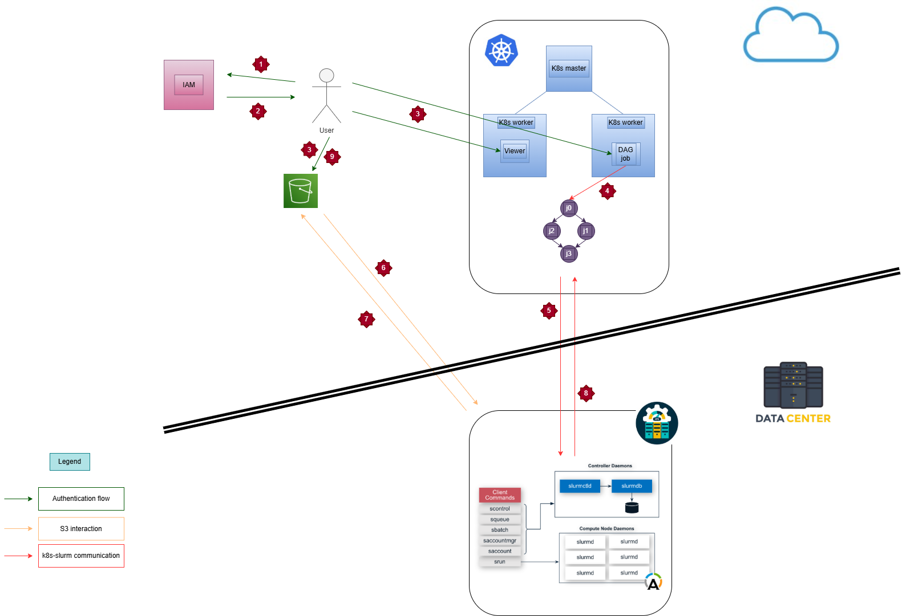
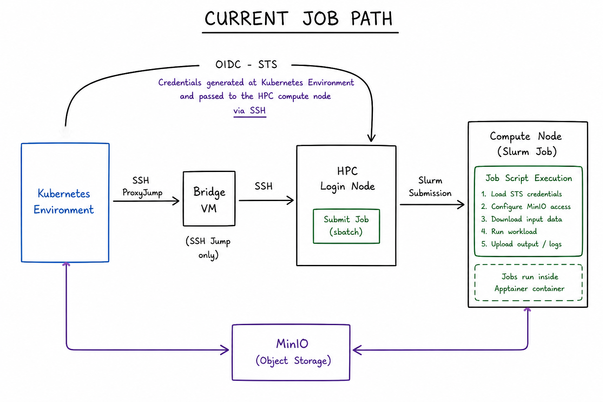

# MSc Thesis Repository

This repository contains the practical work, experimental workflows, scripts, performance analyses, and infrastructure components developed during an MSc thesis focused on integrating:

- Kubernetes-based orchestration
- Slurm-managed HPC systems
- containerized scientific applications
- MPI and GPU-enabled workloads
- S3-compatible object storage
- secure distributed workflow execution

The project investigates how cloud-native orchestration and HPC infrastructures can be combined to support scalable and reproducible computational biology workflows.

The work was developed using HPC infrastructure at INFN-CNAF.

---

# Project Architecture

The overall workflow architecture is shown below.



---

# Workflow Path

The practical execution workflow used throughout the project is summarized below.



The workflow includes:

1. initiating execution from a cloud-side environment
2. secure access through an intermediate bridge layer
3. Slurm-based job submission on the HPC cluster
4. execution of scientific workloads
5. interaction with S3-compatible object storage
6. retrieval of logs, outputs, and metadata

---

# Repository Structure

```text
Thesis/
├── README.md
├── apptainer/
├── hpc-kubernetes/
├── namd/
└── slurm/
```

---

# Repository Components

## [`namd/`](./namd)

Contains molecular dynamics workflows and performance experiments performed with NAMD.

This section includes:

- ApoA1 simulations
- STMV simulations
- CPU scaling experiments
- GPU scaling experiments
- MPI execution tests
- performance analysis
- wall clock, speedup, and efficiency measurements
- plotting and analysis scripts

Additional details and simulations results are documented inside:

- [`namd/README.md`](./namd/README.md)
- [`namd/performance_tests/README.md`](./namd/performance_tests/README.md)

---

## [`hpc-kubernetes/`](./hpc-kubernetes)

Contains the orchestration and workflow integration layer developed between cloud-side environments and the HPC cluster.

This section includes:

- SSH ProxyJump workflows
- dynamic Slurm script generation
- MinIO-based data transfer
- OIDC-based temporary credential passing
- automated HPC job submission
- workflow orchestration scripts

The orchestration scripts demonstrate how scientific workloads can be initiated from external environments and executed on Slurm-managed HPC infrastructure.

Additional details are documented inside:

- [`hpc-kubernetes/README.md`](./hpc-kubernetes/README.md)

---

## [`apptainer/`](./apptainer)

Contains Apptainer-based container workflows developed for scientific software execution on HPC systems.

This section includes:

- containerized NAMD workflows
- containerized VMD workflows
- FFmpeg integration
- GPU-enabled container execution
- Slurm-integrated container execution
- reproducible runtime environments

Additional details are documented inside:

- [`apptainer/README.md`](./apptainer/README.md)

---

## [`slurm/`](./slurm)

Contains Slurm-related experiments, job scripts, and MPI execution examples.

This section includes:

- basic Slurm job submission
- MPI-based execution examples
- CPU resource allocation experiments
- simple distributed MPI workloads
- Slurm execution monitoring

Additional details are documented inside:

- [`slurm/README.md`](./slurm/README.md)

---

Currently contains:

- working Slurm execution workflows
- MPI-based distributed execution experiments
- CPU and GPU NAMD tests
- Apptainer-based scientific workflows
- MinIO-integrated HPC execution
- OIDC-based temporary credential using
- Kubernetes-to-HPC orchestration prototypes
- automated workflow submission scripts
- performance analysis and visualization tools

---

# Thesis Focus

The overall thesis investigates how cloud-native orchestration systems and HPC infrastructures can be combined to support scalable scientific workflows while maintaining:

- reproducibility
- portability
- automation
- distributed execution capability
- secure data transfer
- efficient resource utilization
