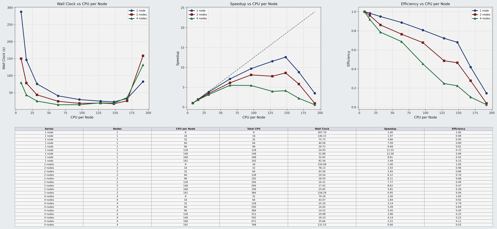
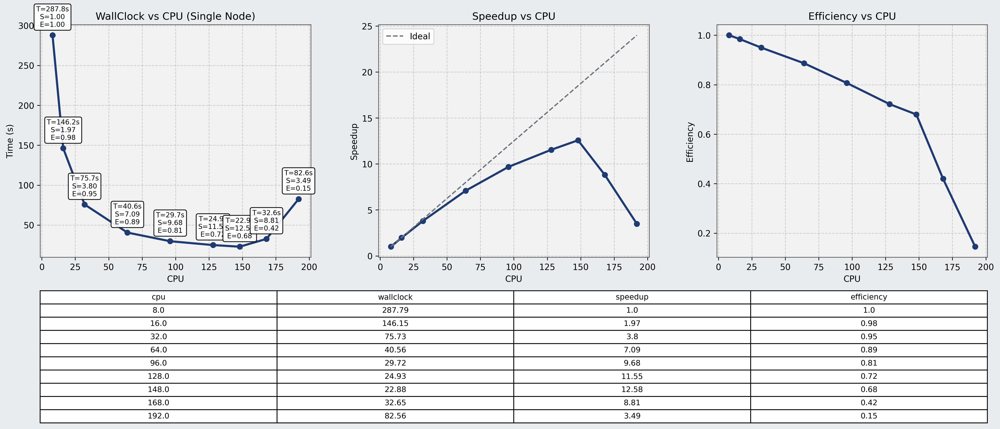
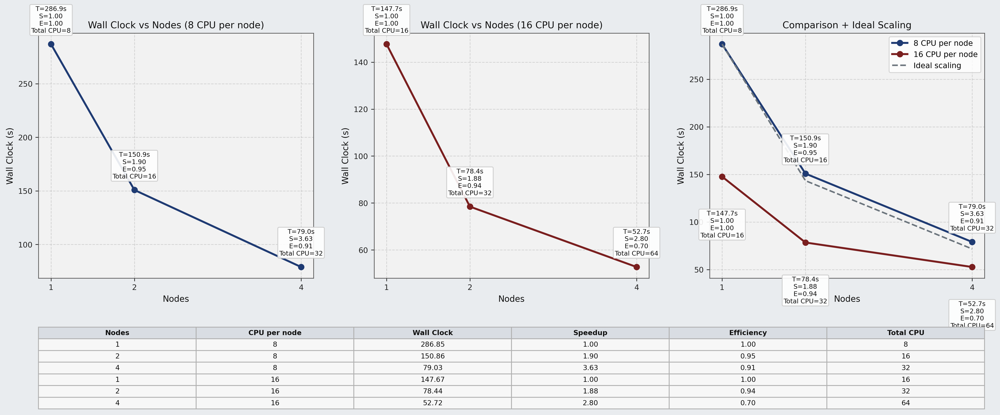
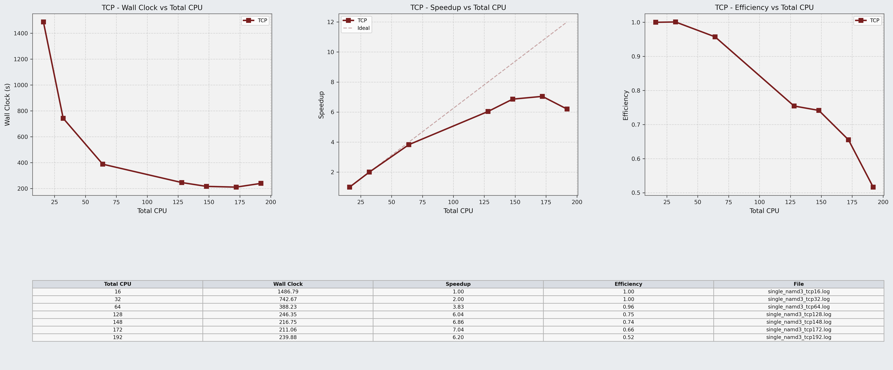
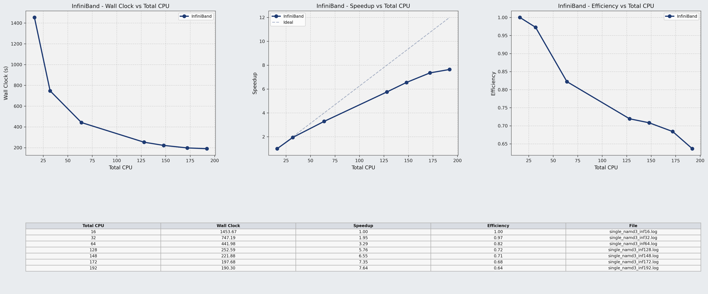
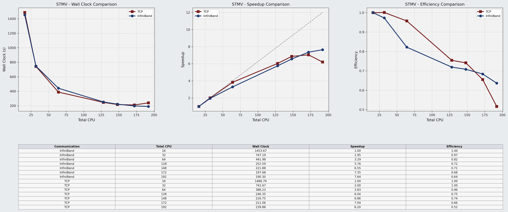
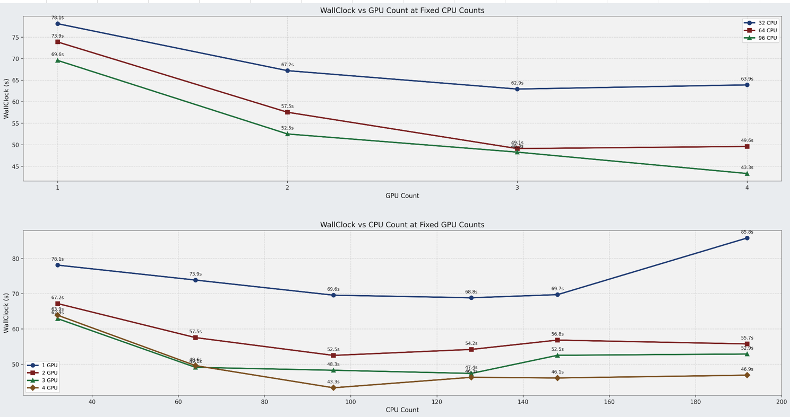

# NAMD Performance Tests

## Overview

This directory contains performance and scaling experiments performed with NAMD on the CNAF HPC infrastructure.

The experiments were designed to evaluate:

- CPU scaling behavior
- multi-node execution behavior
- communication overhead
- TCP vs InfiniBand runtime differences
- GPU acceleration with CUDA
- CPU-GPU balance
- Apptainer runtime overhead

The tests were performed using both the ApoA1 and STMV molecular systems.

All experiments in this section were executed using:

```text
5000 simulation steps
```

This allowed wall clock time, speedup, and efficiency values to be compared consistently across different configurations.

---

# ApoA1 CPU Scaling Tests

The ApoA1 system was used to evaluate CPU scaling behavior across multiple node configurations.

The tests included:

- single-node execution
- two-node execution
- four-node execution
- varying CPU counts per node

The workload showed relatively strong scaling behavior at moderate CPU counts.

Performance improved consistently up to approximately:

- 128 CPU cores
- 148 CPU cores

Beyond this range, communication overhead and resource contention became increasingly visible.

Very high CPU configurations such as:

- 168 CPUs
- 192 CPUs

showed clear efficiency degradation and wall clock instability.

---

## ApoA1 Multi-node Scaling



---

## ApoA1 Single-node Speedup



---

## ApoA1 8 vs 16 CPU-per-node Comparison



---

# STMV CPU Scaling Tests

The STMV system is significantly larger and more communication-intensive than ApoA1.

Because of this, STMV was used to investigate:

- MPI communication behavior
- runtime scalability
- network transport effects
- execution overhead at high CPU counts

The tests compared:

- TCP-based communication
- InfiniBand-based communication
- Apptainer-based execution

---

# STMV TCP Scaling

TCP-based tests showed stable scaling behavior at moderate CPU counts.

However, efficiency degradation became increasingly visible at larger configurations.

At very high CPU counts, communication overhead reduced scaling efficiency significantly.



---

# STMV InfiniBand Scaling

InfiniBand-based execution generally produced better high-core-count behavior compared to TCP.

The improvement became more visible at larger CPU counts where communication overhead became more dominant.



---

# STMV TCP vs InfiniBand Comparison

The comparison below shows the scaling behavior differences between TCP and InfiniBand communication methods.



General observations:

- TCP and InfiniBand behaved similarly at low CPU counts
- InfiniBand became more advantageous at higher CPU counts
- communication overhead became increasingly important for STMV
- scaling efficiency decreased as synchronization costs increased

---

# STMV CUDA Scaling Tests

CUDA-enabled NAMD runs were also tested using GPU nodes.

The experiments evaluated:

- 1 GPU
- 2 GPU
- 3 GPU
- 4 GPU

with varying CPU counts.

The results showed that GPU acceleration significantly improved performance compared to CPU-only execution.

However, scaling was not perfectly linear.

The experiments also showed that:

- increasing GPU count alone is not sufficient
- CPU-GPU balance strongly affects performance
- excessively large CPU counts can reduce efficiency
- some configurations reached saturation points earlier than expected

The most stable results were generally observed around:

- 64 CPUs
- 96 CPUs
- 128 CPUs

depending on GPU count.

---

## STMV CUDA Scaling



It should also be noted that the current STMV configuration used for the GPU-enabled tests represents a relatively small workload for multi-GPU execution.

As GPU count increased, the expected scaling behavior was not always achieved because communication and synchronization overhead began to dominate the runtime more strongly than the actual computational workload.

As a result, GPU utilization efficiency decreased at some configurations, especially at higher CPU and GPU counts.

For this reason, these experiments should be repeated in the future using:

- larger simulation systems
- longer simulation runs
- heavier GPU workloads

in order to better evaluate multi-GPU scaling behavior under more computationally intensive conditions.

---

# Apptainer Runtime Observations

Some STMV tests were also executed inside Apptainer containers.

| Configuration | Native Runtime Infiniband (s) | Apptainer Runtime (s) |
|---|---:|---:|
| 16 CPU | 1453.67 | 1616.55 |
| 32 CPU | 747.19 | 847.18 |
| 64 CPU | 441.98 | 524.75 |
| 128 CPU | 252.59 | 319.85 |
| 148 CPU | 221.88 | 276.53 |
| 172 CPU | 197.68 | 247.89 |
| 192 CPU | 190.30 | 241.89 |

The containerized runs showed:

- slightly higher wall clock times
- additional runtime overhead
- lower efficiency compared to native host execution

Despite this overhead, the containerized workflow remained stable and reproducible.

This was considered an acceptable tradeoff for:

- portability
- reproducibility
- simplified software deployment
- integration with larger workflow orchestration systems

---

# General Conclusions

The experiments demonstrated several important HPC execution behaviors:

- moderate CPU scaling generally worked well
- very high CPU counts often reduced efficiency
- communication overhead became dominant for larger systems
- InfiniBand improved scalability for communication-heavy workloads
- GPU acceleration provided major performance improvements
- CPU-GPU balance was critical for efficient execution
- Apptainer introduced moderate overhead but improved portability

Also the tests provided a practical evaluation of NAMD execution behavior across:

- single-node environments
- multi-node MPI environments
- GPU-accelerated workloads
- containerized HPC workflows
- different communication/runtime configurations
